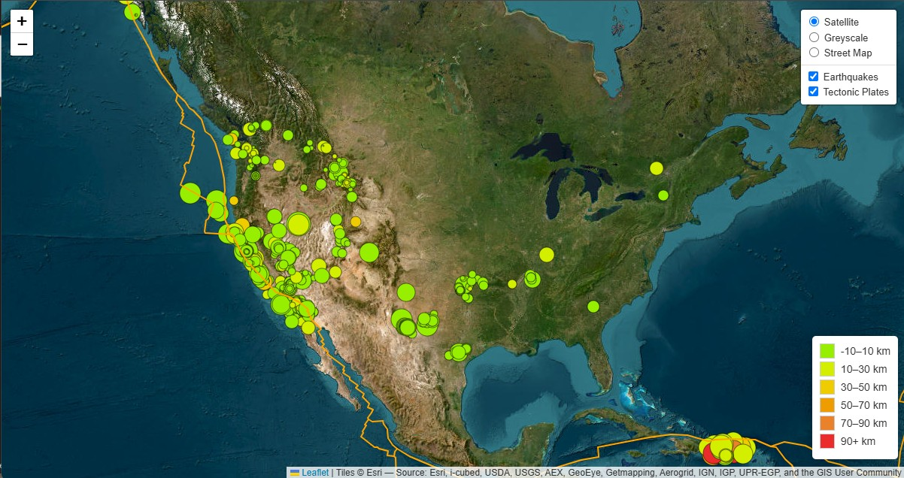

# Earthquake and Tectonic Plate Map

This project displays earthquake data and tectonic plate boundaries on an interactive map using Leaflet and D3.js. The map includes multiple basemaps and dynamic features like color-coded earthquake markers based on depth and magnitude, as well as tectonic plate boundaries.

## Features
* Interactive map displaying earthquake data from the USGS feed.
* Dynamic earthquake markers with size and color reflecting magnitude and depth.
* Tectonic plate boundaries visualized using GeoJSON data.
* Multiple basemaps: Satellite Imagery, Greyscall, and Street Map.
* Legend showing earthquake depth ranges with corresponding colors.

## Installation
1. Clone the repository:
```bash
git clone https://github.com/eli-crawley/leaflet-challenge
cd leaflet-challenge
```
2. Open the index.html file in a web browser.

## Dependencies
* Leaflet.js: JavaScript library for interactive maps.
* D3.js: JavaScript library for manipulating documents based on data.
* GeoJSON data:
    * Earthquake data: USGS earthquake feed (GeoJSON format).
    * Tectonic Plate data: GeoJSON data from fraxen/tectonicplates GitHub repository.

## Features and How It Works
### 1. Basemaps
This map supports multiple basemaps that you can toggle between, including:

* Satellite: Satellite imagery.
* Greyscale: A minimalist, grayscale basemap for better contrast with data.
* Street Map: Standard OpenStreetMap streets.

### 2. Earthquake Data
The map pulls real-time earthquake data for the past 7 days from the USGS feed:
* Earthquake markers are dynamically sized and colored based on the magnitude and depth.
* Popup for each earthquake showing its magnitude, location, and depth.

### 3. Tectonic Plates
The map also displays tectonic plate boundaries using GeoJSON data. These are shown as lines representing the edges of Earth's tectonic plates.

### 4. Color Legend
A color legend is provided in the bottom-right corner to help users interpret the earthquake depths with corresponding colors.

## Example Screenshot


# References
References
Dataset created by the United States Geological Survey. https://earthquake.usgs.gov/earthquakes 